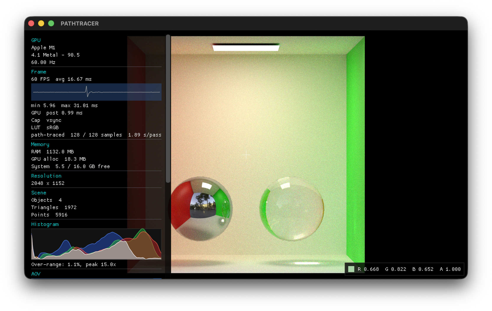

# Physically based path tracer

*A CPU, unidirectional brute-force Monte Carlo path tracer with real-time progressive display: Embree-accelerated, stochastic BSDF sampling combined with environment-map NEE via MIS, behind a thin OpenGL display/HUD layer.*



## Contents

- [Build](#build)
- [1. Pipeline](#1-pipeline)
- [2. Component reference](#2-component-reference)
- [3. Material library](#3-material-library)
- [4. AOV reference](#4-aov-reference)
- [5. Roadmap](#5-roadmap)
- [6. References](#6-references)

## Build

C++20, built with CMake. Currently developed against macOS only.

### Prerequisites

```
brew install cmake glfw glew glm imath openexr opencolorio embree
```

Homebrew's `embree` formula pulls in `tbb` automatically (Embree's own internal parallelism dependency); no separate install step needed for it.

Dear ImGui is vendored as a git submodule (`third_party/imgui`); initialise it before configuring:

```
git submodule update --init --recursive
```

### Configure & build

```
cmake -B build
cmake --build build
```

This produces nine targets:

- `build/engine`: the path tracer
- `build/test_pattern`: EXR calibration-pattern generator (`tools/test_pattern.cpp`)
- `build/downsample`: EXR downsampling tool (`tools/downsample.cpp`)
- `build/embree_validate`: headless Embree ray-scene intersection correctness check (`tools/embree_validate.cpp`)
- `build/bsdf_validate`: headless BSDF pdf-normalization and furnace-test check (`tools/bsdf_validate.cpp`)
- `build/nee_validate`: headless NEE/MIS unbiasedness check against a brute-force reference (`tools/nee_validate.cpp`)
- `build/rasterizer_validate`: headless CPU-rasterizer-vs-Embree G-buffer correctness check (`tools/rasterizer_validate.cpp`)
- `build/integrator_validate`: headless full-integrator depth-invariance and transport-partition correctness check (`tools/integrator_validate.cpp`)
- `build/raster_bench`: rasterizer timing harness, not run under `ctest` (`tools/raster_bench.cpp`)

`-Wall -Wextra -Werror` gates every target. If `clang-tidy` is installed, it also runs on every compile of `engine`'s own sources (see `.clang-tidy`); if `cppcheck` is installed, `cmake --build build --target cppcheck` runs it over `src/`. Both are skipped, not required, if not installed.

`cmake -B build -DENGINE_SANITIZE=ON` builds with AddressSanitizer + UndefinedBehaviorSanitizer instead (off by default); worth running after touching the glTF/JSON/EXR loading paths.

### Run

```
./build/engine [--scene path/to/scene.json]
```

Defaults to `assets/scenes/tree.json` if `--scene` is omitted.

## 1. Pipeline

glTF geometry/materials load once at startup into a CPU-resident scene: per-vertex shading data (`ShadingTriangle`) and world-space triangles feed an Intel Embree scene (`EmbreeAccel`); materials keep only CPU `HdrImage` textures, sampled per-ray. An equirectangular HDR environment map loads alongside it, with its own luminance-based importance-sampling CDF for NEE.

Every frame, on any camera/scene-state change, `PathTraceDriver` hands a fresh request to a background thread pool (one worker per hardware core, row-parallel, dynamic scheduling), which restarts progressive accumulation:

- Camera ray generation (pinhole) → Embree ray-scene intersection (`rtcIntersect1`/`rtcOccluded1`)
- BSDF evaluation/sampling (Heitz 2018 GGX VNDF specular, EON rough-diffuse (Portsmouth, Kutz, Hill 2025), Walter 2007 rough dielectric transmission with exact Fresnel and TIR (falling back to a Snell delta lobe below the smooth-roughness threshold), Kulla-Conty multiple-scattering compensation on both the reflective and transmissive interface, exact complex-IOR conductor Fresnel from Gulbrandsen 2014's reflectivity/edge-tint parameterisation) → next-event estimation against the environment map, MIS-combined with BSDF sampling (power heuristic, Veach 1997)
- Recursive bounce loop with Russian roulette, Chiang/Li/Burley 2019 shadow-terminator-corrected secondary-ray origins, Beer-Lambert extinction while a path is inside a transmissive material
- Radiance + a full G-buffer/transport-component AOV set accumulated per pass, published as a snapshot the render thread reads lock-free

Independently, on the same trigger, a synchronous CPU rasterizer (`rasterizer.cpp`) computes the 15 primary-hit-only AOVs (§4) directly on the render thread every frame: edge-function rasterization (Pineda 1988) with a near-plane Sutherland-Hodgman clip, sharing `gbuffer_shading.h`'s material sampling with the path tracer but no Embree, BSDF, or recursion. This gives those AOVs instant, glitch-free feedback during camera movement, decoupled from Beauty's own progressive convergence; the path-traced request above only restarts when the selected AOV actually needs light-transport data.

The render thread blits whichever AOV is selected through OCIO's display transform (exposure/tone-mapping) and the debug HUD, converging visibly over subsequent passes rather than blocking on a single long render. No GPU rasterization anywhere in this path: OpenGL exists only for the window, the post-process/OCIO blit, and ImGui; the primary-hit rasterizer above is CPU-only.

## 2. Component reference

| Feature | Mechanism | Role / why it matters |
|---|---|---|
| Camera / lens | Position/yaw/pitch, film-back + focal length → derived vertical FOV; pinhole primary rays derived directly from this basis | Geometric ground truth the ray-intersection/BSDF math is measured against |
| Photographic exposure | EV100 from aperture/shutter/ISO, applied as a relative-stops delta against profile.json's default triple (Filament/Frostbite EV100 formula) | Familiar photographic controls for adjusting display brightness; not an absolute photometric quantity, since the scene isn't calibrated to real-world radiance |
| OpenEXR linear pipeline | `HdrImage`/`loadExr`; all shading/compositing in linear light, OCIO display-encodes only at the final blit | Precondition for correct PBR colour math |
| Display transform | OCIO Display/View API (sRGB, Rec.709, Raw), cycled at runtime ('L') -- a colorimetric encode (sRGB / Rec.1886 OETF) only, no tone mapping | Scene-referred linear radiance throughout; values above 1.0 clip at the display by design, so lookdev sees clipping honestly rather than under a hidden filmic shoulder |
| GPU/system readout | Device name, driver/API version, refresh rate, RAM at startup | Confirms the actual GPU/backend before a wrong-adapter bug masquerades as a render bug |
| Frame-timing HUD | Ring buffer of recent frame times; rolling FPS/avg/min/max, GPU timer query around the post-process blit | Makes blit cost measurable frame to frame |
| Memory HUD | Live RAM readout plus GPU allocation tracked at alloc/free (the path-traced display texture is the only GPU allocation left; OCIO uses zero LUT textures) | Surfaces a memory regression immediately, not after VRAM exhaustion |
| Scene stats | Object/triangle/point counts, viewport resolution | Scene-complexity readout |
| Debug camera controls | WASD/QE fly, R reset, LMB-drag orbit around a pivot read directly from the path tracer's own G-buffer (world-space hit position + hit mask at its centre pixel) | Interactive navigation without hand-editing camera parameters between runs |
| Camera framing overlays | Centre crosshair, always on, drawn on the foreground overlay over the viewport | Composition aid that never contaminates the AOV buffers being debugged |
| AOV selector | Dropdown across the full AOV set (§4), plus R/G/B channel-isolation hotkeys | Isolates one signal at a time for debugging |
| Live histogram | Per-channel (R/G/B) histogram of the currently displayed image | Catches exposure/clipping and colour-space bugs a single still frame can hide |
| glTF loading | cgltf; per-primitive vertices baked to world-space triangles/shading data at load time, materials' textures decoded once to `HdrImage` | Standard interchange format; nothing GPU-resident is needed once the CPU Embree scene/shading data exists |
| Tangent-space normal mapping | Per-vertex tangent (glTF-supplied only), Gram-Schmidt re-orthogonalized per-ray | Surface micro-detail without extra geometry |
| Ray acceleration | Intel Embree (SIMD BVH build/traversal), CPU, built once at load | Sub-linear ray-scene intersection, required before recursion is affordable |
| Primary-hit rasterizer | CPU edge-function rasterization (Pineda 1988) + near-plane clip (Sutherland-Hodgman 1974), row-parallel, synchronous every frame | Instant primary-hit G-buffer AOVs (§4), decoupled from Beauty's progressive convergence |
| Stochastic BSDF | EON rough-diffuse (Portsmouth, Kutz, Hill 2025), GGX microfacet specular, Walter 2007 rough dielectric transmission (delta Snell + TIR below the smooth-roughness threshold), Kulla-Conty multiple-scattering compensation on the reflective and transmissive interface alike; four-lobe stochastic selection, one-sample mixture estimator | Materials respond to light with real physical behaviour, including rough and smooth glass, and conserve energy at every roughness |
| Volumetric absorption | Beer-Lambert extinction (`transmissionColor`/`transmissionDepth`, Arnold `standard_surface` convention) applied to a single-level medium stack while a path is inside a `transmissionFactor>0` material | Tinted/coloured glass without participating-media in-scattering (§5 Large item 2) |
| Per-object materials | `SceneConfig::materialOverrides` (glTF node name → `materials/*.json` path) builds a per-instance settings vector, indexed by `ShadingTriangle::instanceIndex` through both render paths | Different objects in one scene can carry different materials (e.g. a chrome sphere and a glass sphere in the same Cornell box) |
| Environment lighting | Equirect HDR map, BSDF-sampled misses + luminance-importance-sampled NEE, MIS-combined | The scene's sole light source: image-based, no punctual/area lights |
| Russian roulette | Survival probability clamped from running throughput from `russianRouletteStartBounce`, reweighted by `1/p` | Keeps recursion finite without biasing the estimator |
| Progressive accumulation | Each background pass re-traces at the current camera/settings and averages into the displayed result; any camera/scene change restarts accumulation | Real-time-interactive without waiting for a single long render to finish |

## 3. Material library

Named presets (`assets/materials/*.json`), parsed into `MaterialConfig` (`scene_config.h`) and assigned per-scene via `SceneConfig::materialPath` (the scene's default material) plus an optional per-object override, `SceneConfig::materialOverrides` (glTF node name → material JSON path) -- e.g. `assets/scenes/cornell.json`'s `{"sphere01": "materials/chrome.json", "sphere02": "materials/glass.json"}`, cornell box left on the scene default. Overrides build a per-instance settings vector indexed by `ShadingTriangle::instanceIndex` through both render paths (§2 Per-object materials).

| File | metallic | transmission | roughness (factor / min) | Role |
|---|---|---|---|---|
| `default.json` | 0.0 | 0.0 | 1.0 / 0.045 | Material for the default scene (`tree.json`, `materialPath`); rough dielectric, heavy bump (`bumpStrength: 10.0`) |
| `diffuse.json` | 0.0 | 0.0 | 0.5 / 0.045 | Neutral matte dielectric, no bump |
| `chrome.json` | 1.0 | 0.0 | 0.05 / 0.045 | Polished conductor, exact complex-IOR Fresnel from Gulbrandsen reflectivity/`edgeTint` (`diffuseColour` doubles as `f0`, i.e. the reflectivity `r`) |
| `glass.json` | 0.0 | 1.0 | 0.02 / 0.01 | Smooth/clear dielectric, `ior: 1.5`; tinted via Beer-Lambert `transmissionColor: [0.96, 0.98, 1.0]` over `transmissionDepth: 0.4` world units, not `diffuseColour` |

`MaterialConfig` fields:

| Field | Meaning |
|---|---|
| `diffuseColour` | Multiplies `baseColorTexture`; also the conductor lobe's `f0` tint |
| `metallicFactor` / `transmissionFactor` | Lobe selection -- a material is dielectric, conductor, or transmissive, not blended between (every shipped file uses 0.0/1.0) |
| `roughnessFactor` | Multiplies the roughness texture sample, before the `roughnessMin`/`roughnessMax` clamp |
| `roughnessMin` / `roughnessMax` | Per-material clamp on the roughness sample; a material can floor below the shared 0.045 (e.g. glass's 0.01) for a genuinely smooth GGX lobe |
| `ior` | Dielectric IOR, non-metal lobes only |
| `diffuseRoughness` | EON rough-diffuse parameter r ∈ [0,1] (Portsmouth, Kutz, Hill 2025); 0 = Lambertian |
| `bumpStrength` | Scales the bump texture's per-texel height difference |
| `transmissionColor` / `transmissionDepth` | Beer-Lambert absorption coefficient (`sigmaA = -log(transmissionColor)/transmissionDepth`, Arnold `standard_surface` convention), applied while a path is inside a `transmissionFactor>0` material. Optional, default `[1,1,1]`/`1.0`: a true no-op, so existing materials didn't need editing when this shipped (§2 Volumetric absorption) |

The first nine fields are required (`j.at`, missing/malformed fails the load and logs to stderr); `transmissionColor`/`transmissionDepth` are parsed optional-with-default (`j.value`). Add a new material by dropping a JSON file in `assets/materials/` and pointing `materialPath`/`materialOverrides` at it -- no code or schema change needed.

## 4. AOV reference

Every AOV below is computed by the path tracer each pass, except: the 15 primary-hit-only AOVs (Alpha, Depth, WorldPos, UV, Normal, GeomNormal, Albedo, Metallic, Roughness, Tangent, ObjectID, Fresnel, IOR, AO, Wireframe), which come from the synchronous CPU rasterizer (§1, §2) instead, refreshed every frame; and HSV/Luminance/Sobel/Gabor, GPU post-filters of the Beauty image (shared `PostProcessPass`, run once per selection, not per-pass).

| AOV | Category | Mechanism | Role / why it matters |
|---|---|---|---|
| Beauty | Utility | Final accumulated radiance, post tone-mapping | The primary output |
| Wireframe | Utility | Screen-space line rasterization (Pineda 1988), z-tested against the scene's own depth: white mesh-triangle edges, yellow scene-bounding-box edges (drawn on top, so yellow wins) | Visualizes triangle density/topology and sanity-checks scene extent/framing in one combined view |
| Alpha | Utility | 1.0 on a primary hit, 0.0 on a primary miss | Real coverage mask (this renderer isn't opaque-only-by-construction) |
| Depth | Utility | Planar camera-space Z (Arnold/RenderMan/EXR "Z" convention) at the primary hit | Depth-based compositing/debugging |
| HSV | Utility | Colour-space transform of Beauty | Isolates hue/saturation shifts a pure RGB view can hide |
| Luminance | Utility | Rec.709 luminance of Beauty | Isolates perceived brightness from colour |
| Sobel | Utility | 3×3 Sobel gradient magnitude of Luminance | Cheap edge/gradient signal |
| Gabor | Utility | 4-orientation Gabor kernel bank, max response, of Luminance | Directional edge/texture response Sobel's isotropic magnitude can't distinguish |
| WorldPos | Utility | Raw world-space primary-hit position | Debugging geometry/UV placement independent of shading |
| UV | Utility | Primary-hit interpolated UV (fractional part) | Visualizes the texture-space mapping directly |
| Normal | Material | Shading (normal-mapped) normal at the primary hit | The normal actually used in shading |
| GeomNormal | Material | Smooth interpolated vertex normal, before normal-mapping | Separates a bad normal map from a bad base mesh |
| Albedo | Material | Base-colour texture sample at the primary hit | Isolates texture data from lighting |
| Metallic | Material | Per-instance metallic factor (`settings.metallicFactor`, `materials/*.json` or `SceneConfig::materialOverrides`), uniform within one object's triangles but no longer whole-image-constant now that per-object material assignment exists | Debug which instance carries which metallic value |
| Roughness | Material | Roughness texture × a per-instance factor, floored at that material's own `roughnessMin` (materials can set their own floor, e.g. glass's below diffuse/chrome's shared 0.045); the texture varies per hit, the multiplying factor/floor vary per instance | Debug material authoring independent of shading |
| Tangent | Material | Shading tangent basis at the primary hit | Debugs the tangent-space basis used for normal mapping |
| ObjectID | Material | Per-instance index, false-coloured (`falseColorForId`) | Isolation mask for compositing/debugging |
| AO | Material | Authored ambient-occlusion texture sample at the primary hit | Debug baked AO independent of lighting |
| Fresnel | Transport | `mix(exact dielectric Fresnel, exact complex-IOR conductor Fresnel, metallic)` at the primary hit's view angle — the same term shading evaluates (`fresnelAtViewAngle`, `bsdf.h`), against the macro normal rather than a microfacet half-vector | Debug grazing-angle reflectance behaviour in isolation, including the conductor dip an authored `edgeTint` produces, which the previous Schlick term could not represent at any `f0` |
| IOR | Transport | Per-instance dielectric IOR (`settings.ior`), -1 on a miss | Isolates the raw refractive-index input driving Fresnel/transmission |
| BounceCount | Transport | Mean path termination depth across samples, per pixel | Debug Russian roulette/termination behaviour |
| DirectDiffuse | Lighting | Diffuse-bucketed radiance from a path's first (bounce-0) surface, physical (base colour included) | Isolates direct diffuse light arrival, in the same units as Beauty |
| IndirectDiffuse | Lighting | Diffuse-bucketed radiance from later bounces | Isolates indirect (bounced) diffuse contribution |
| DirectSpecular | Lighting | Specular-reflection-bucketed radiance, one bounce from camera | Isolates direct specular contribution |
| IndirectSpecular | Lighting | Specular-reflection-bucketed radiance, later bounces | Isolates indirect specular (reflections) |
| Refraction | Lighting | Radiance from any path that sampled a transmission lobe (sticky bucket) | Isolates glass/transmissive transport |
| Shadow | Lighting | Binary NEE occlusion test toward the env light at the primary hit, re-averaged across progressive passes into continuous shadow/penumbra density | Isolates direct-light visibility from material/lighting colour |

## 5. Roadmap

Ordered quick → complex; items within **Large** are a strict dependency chain (each needs the ones before it) and must land in that order. Items elsewhere have no hard blocker on one another.

### Quick

- **Expand terminal output (launch + loop)**: startup logs GL extensions/camera pose/model/BVH stats (`main.cpp:286-361`); no per-frame stats print during the interactive loop (`main.cpp:990`); sample/pass/convergence stats reach only the HUD (`hud_overlay.cpp`), not stdout.
- **Texture bit depth (16/32) via JSON**: hardcoded `GL_RGBA16F` today (`texture.cpp:45`); 32F ~doubles VRAM/buffer.
- **Screen capture to PNG**: dump the composited, LUT-applied Beauty framebuffer (`glReadPixels`, precedent at `main.cpp:670`) before `app.hud.render()` (`main.cpp:944`) so HUD, crosshair (`hud_overlay.cpp:266`), and the pixel probe panel (`hud_overlay.cpp:381`) are excluded. No PNG encoder in the tree yet (`third_party/imgui`'s is unrelated); needs one added.
- **Ground-truth pixel probe (remove clamp)**: Beauty and the post-filter AOVs (HSV/Luminance/Sobel/Gabor) read the composited, OCIO-display-transformed framebuffer via `glReadPixels` (`main.cpp:680-683`), divided by 255 — clamped to 0-1 and 8-bit-quantized. Every other AOV already samples the raw `HdrImage` texel directly (`main.cpp:669`), full float, no clamp. Route Beauty through the same pre-display-transform float buffer `updateOverRangeStats` already uses (`main.cpp:881`) instead of reading framebuffer 0 — the histogram had the identical bug, fixed the same way (`hud_overlay.cpp:242`).
- **Probe panel border**: no ImGui window has a border (`style.WindowBorderSize = 0.0F`, `hud_overlay.cpp:430`); the probe swatch explicitly disables its own too (`hud_overlay.cpp:394`). Mirror the histogram panel's semi-transparent border (`ImDrawList::AddRect`, `IM_COL32(60,60,60,180)`, `hud_overlay.cpp:259`) around the probe panel (`hud_overlay.cpp:390`).
- **Expand reset (`0`) to full launch state**: `DebugCameraController::resetToDefault()` (`debug_camera_controller.cpp:122-127`, bound at `main.cpp:494-495`) resets only camera position/yaw/pitch/orbiting. Exposure-triangle defaults are already stored but never applied (`defaultAperture_`/`defaultShutterSeconds_`/`defaultIso_`, `debug_camera_controller.h:77-79`). Also not reset: `app.aov`, `userLut`, `channelView`, `invert`, `showHud`, `envRotationDegrees`, `showSky`, `envExposureStops` (`main.cpp:153-233`).
- **Cornell as default scene**: `main.cpp:1007`'s `Options::scenePath` defaults to `scenes/tree.json`; `scenes/cornell.json` is already fully wired (materials, HDRI). One-line default change; `tree.json`'s stump model currently has no floor (see Ground plane, §5 Moderate), so it stays reachable via `--scene` rather than being removed.
- **PNG capture tool hardening**: `tools/render_beauty.cpp`'s `writePng` (lines 68-111) pipeline order is correct (exposure → OCIO display transform → dither → clamp → quantize, lines 198-234). Two gaps: RGB-only, no alpha channel (`colour type 2`, line 95); scanline filter is hardcoded to type 0/None despite a comment claiming adaptive filtering (lines 70-74). Fix the comment or implement real adaptive filtering; add alpha output if a future consumer needs it.
- **Gate the EON sampling shape on `diffuseKd`**: `diffuseRoughness` conflates the EON diffuse *value* with the *sampling strategy* for the borrowed cosine multi-scatter lobe. The two decouple whenever `diffuseKd` is zero — `metallic=1` or `transmissionFactor=1` zeroes it (`bsdf.cpp:643`) while `diffuseProb` stays non-zero (`bsdf.cpp:641`) — so a conductor still draws CLTC (`sampleEon`, `bsdf.cpp:531`) to shape a lobe EON does not describe. Measured on `chrome.json` at 1976/691200 channels, max 11/255, for a 1.2% variance penalty; worked around there by authoring `diffuseRoughness: 0`, which fixes one asset and not the mechanism, so any future rough conductor pays it again. Gate the *shape* on `diffuseKd` at both `sampleEon` and `pdfEon` (`bsdf.cpp:543`), which stay consistent because `diffuseKd` is deterministic from params. Not the *density*: `bsdf.cpp:362` forbids gating the pdf on kd, since the selection probability is independent of it and starving the mixture denominator inflates throughput for metals.
- **Put the conductor `F_avg` on the Gulbrandsen basis**: the multiple-scattering tint takes `F_avg` from `schlickFresnelAvg` (`bsdf.cpp:288`), which is Karis' `f0+(1-f0)/21` — the *exact* cosine mean of Schlick, and so no longer the mean of the conductor's single-scatter Fresnel now that it is exact complex-IOR (`fresnelConductor`). Measured against the true cosine mean: `-1.7e-5` at `f0=1`, `-0.0083` at `chrome.json`'s `r=0.95`, worst `-0.086` around `r=0.25`. `multiScatterTint` (`bsdf.cpp:298`) is monotone in it, so the error is always an under-return, scaling with the deficit `(1-E)`: under `3e-4` at roughness ≤ 0.05, up to `0.048` of incident radiance for a mid-reflectivity metal at roughness 1. **No test in the suite can see it** — `checkWhiteFurnaceTwoSided` is `f0=1` only, where it vanishes, and `checkFurnace`'s coloured-metal rows are upper-bound-only and so blind to a loss; a two-sided *grey*-conductor furnace has no closed form, which is why the honest fix is to correct `F_avg` rather than test around it. Needs an `F_avg` over `(r, g)`, the same shape as `dielectricFresnelAvg` (`bsdf.cpp:286`), itself a measured rational fit. `coatAlbedo` (`bsdf.cpp:317`) has the identical pre-existing inconsistency — Karis applied to `coatF0` while the dielectric single-scatter evaluates exact `fresnelDielectric` — and should be fixed alongside, since `dielectricFresnelAvg` already exists for it.
- **High-frequency binary noise texture/material**: no such asset exists today. Add as a stress-test material/texture for the Texture minification filtering item below — deliberately high-frequency content exposes aliasing before/after mip-mapping lands, since sampling is point/bilinear only today (`sampleBilinear`, `hdr_image.h:22`).

### Moderate

- **Recover the delighted DirectDiffuse/DirectSpecular view**: `bdecb41` deliberately made the five transport AOVs physical (each contribution written once, at its physical value) so they exactly partition Beauty, an identity `tools/integrator_validate.cpp:387` (`checkTransportPartition`) now asserts at 1e-4 relative; the prior delighted view (base colour divided out) was the deliberate casualty of that fix, not a regression, and the commit message names its replacement as `DirectDiffuse / Albedo`. Not Quick because Albedo is a `RasterGBuffer` field (`rasterizer.cpp:321`) and `main.cpp:773-808`'s `aovNeedsLightTransport` gating makes the rasterizer and path tracer mutually exclusive; Albedo and DirectDiffuse are never simultaneously fresh. Needs either a path-traced albedo buffer (3 more accumulator lanes) or relaxing that gating.
- **Frustum/backface culling**: skip `buildSubTriangles`'s per-frame full-scene walk (`rasterizer.cpp:153,274`) and the equivalent Embree traversal when out of view.
- **Low-discrepancy sampler upgrade**: Sobol / hash-based Owen scrambling (Burley 2020, §6), replacing randomized Halton (`sampler.cpp`).
- **Render-mode selector + adaptive tiling**: Single Sample / Progressive / Adaptive Tiling (today: the path tracer dispatches fixed 96x96 tiles and the rasterizer rows, both through `ThreadPool`; neither adapts to where the image is still noisy, and the mode is not selectable).
- **Adaptive per-pixel sample budget**: variance-driven, builds on tiling above; `samplesPerPixel` (`profile.json`) is one fixed global today, no per-pixel allocation.
- **Texture minification filtering (MIP-mapping)**: point/bilinear only today (`sampleBilinear`, `hdr_image.h:22`); grazing/distant surfaces alias. No mip chain exists to select from; needs ray differentials to pick a level per ray.
- **Packet tracing**: `EmbreeAccel` calls `rtcIntersect1`/`rtcOccluded1` exclusively (`embree_accel.cpp:116,144`), single-ray only; no `rtcIntersect4/8/16` packet API.
- **Ray reordering before shading**: the tile loop traces in raster order (`path_tracer.cpp:307-320`) with no Morton/direction coherence sort ahead of `tracePath` (`path_tracer.cpp:77`).
- **Deferred/sorted shading by material**: `tracePath` (`path_tracer.cpp:77`) evaluates the BSDF inline per ray; no material-bucketed shading pass.
- **Camera film-back preset drop-down**: `Camera::FilmBack` (`camera.h:13-16`) is one fixed `{widthMm, heightMm}` from `profile.json:5`. JSON-defined preset list (Alexa XT, IMAX, Medium Format, 5D, Leica M11, Red, 35mm, 70mm); `ImGui::Combo` in HUD, existing pattern at `hud_overlay.cpp:297`.
- **Photometric calibration**: tie radiometric output to real photometric units (lux/candela/lumen) so `ev100()` (`camera.h:54-56`) and light intensities can be checked against a light meter instead of eyeballed. Complements the Macbeth chart scene (§5 Large item 1).
- **Optic flow AOV**: per-pixel motion vectors, appended to `AovId` (`aov.h:7-40`). No scene-graph animation yet (§5 Moderate item 14), camera-only motion over static geometry, so this is reprojecting `WorldPos` (§4) through the previous frame's camera transform, not true motion capture. That state doesn't exist: `Camera` (`camera.h:10`) exposes only current `position()` (`camera.h:23`), no stored prior-frame matrix; needs one new persisted matrix, no new ray/sample work.
- **Contact sheet export (grid of every AOV)**: tile thumbnails of all 27 `AovId` (`aov.h:7-40`) at once, vs. the HUD's single `ImGui::Combo` (`hud_overlay.cpp:336`) feeding one `pathTraceDisplayTexture` blit (`presentFrame`, `main.cpp:739`). Same mutual-exclusion blocker as the delighted-view item above: `aovNeedsLightTransport` (`main.cpp:93-108`) partitions the 27 into 12 light-transport / 15 rasterizer AOVs, only one side fresh per frame; needs that gating relaxed, not just N reads of one cached buffer.
- **Scene-graph foundation**: three steps in strict order, the only ordered chain outside **Large**, and the prerequisite for Motion blur (§5 Low priority item 1).
  1. *Indexed geometry.* `gltf_loader.cpp:94-129` de-indexes every mesh into soup and stores positions twice (once in `Triangle` for Embree, once in `ShadingVertex.position` for shading), 184 B/tri, ~920 MB on a 5M-triangle asset. `rtcSetSharedGeometryBuffer` takes a byte stride, so Embree can read positions in place from the indexed shading vertices instead, deleting the `Triangle` array, keeping glTF's own index buffer rather than filling one with the identity sequence (`embree_accel.cpp:77-84`), and dropping the `reserve(size+1)` padding hack. ~5x smaller, and the traversal locality matters more than the footprint.
  2. *Object instancing.* `RTC_GEOMETRY_TYPE_INSTANCE` over one scene per unique mesh, replacing today's single flattened geometry (`embree_accel.cpp:65`) and finally giving `MeshInstance::transform` (`gltf_loader.h:18`, stored and never read) a consumer. `Hit` gains `geomID`/`instID`. Rays trace in object space against shared BVH leaves instead of the per-instance duplication today's flattened soup incurs. Needs (1)'s indexed layout.
  3. ~~*Per-material factors.*~~ **Solved by a different mechanism, not this one.** A scene containing a metal object and a dielectric object is now representable: `SceneConfig::materialOverrides` (glTF node name → `materials/*.json` path) builds a per-instance settings vector independent of (1)/(2) above, no indexed-geometry or instancing prerequisite. `Material` itself still holds only six textures -- `metallic_factor`/`roughness_factor`/etc. are still parsed by cgltf and discarded, and `extrasTextureIndex` (`gltf_loader.cpp:35`) is still the hand-rolled substring scanner it always was. What changed is that per-object factors are authored in `scene.json`/`materials/*.json` (JSON, keyed by node name) rather than in the glTF file itself; moving them onto `Material` for glTF-native authoring remains open if that authoring path is ever wanted.
- **Per-object bounds**: `EmbreeAccel::sceneBounds()` (`embree_accel.cpp:124-129`) computes one `rtcGetSceneBounds()` over a single flattened `RTC_GEOMETRY_TYPE_TRIANGLE` geometry holding every instance's triangles combined (`embree_accel.cpp:53-100`); the only consumer, the Wireframe AOV's box overlay, draws one scene-wide box (`rasterizer.cpp:435-436`). Every triangle already carries `instanceIndex` (`shading_scene.h:21`), so per-object AABBs can be computed by grouping `worldTriangles` by it — no dependency on the Scene-graph-foundation/instancing item above.
- **Occlusion-sensitive curved transmissive test**: `checkTransmissiveSphere` (`tools/integrator_validate.cpp:443`) asserts a white non-absorbing glass sphere is invisible under a uniform environment. That closes one of the two curvature-driven blind spots — reverting the shadow-terminator projection's side reads 0.955/0.877 there while the flat slab stays bit-identical — but it structurally cannot close the other, because a furnace measures how much energy arrives, not where from, and so cannot see a light *leak*. Reverting either curvature-scaled epsilon (`transmissionOffsetEpsilon`, `path_tracer.cpp:43`, used at the far-side NEE shadow ray `path_tracer.cpp:265` and the transmission continuation ray `path_tracer.cpp:335`) leaves the whole suite green: measured deltas 2e-4 and 4e-3, at 64x32 and again at cornell's own 24x12 tessellation, so it is not a tessellation artefact. Needs a configuration where the far-side shadow ray *ought* to be occluded — rough glass against an opaque backdrop. Not Quick because that configuration has no closed-form answer, so it needs a converged-reference or two-estimator invariant rather than an analytic one; every transmissive assertion in the suite today is analytic.
- **Ground plane**: no procedural or reusable ground-plane primitive exists (`assets/shaders/` has only `edge_filter.frag`/`fullscreen_triangle.vert`/`hsv_display.frag`; no ground/plane hits elsewhere in `src`/`include`). Cornell's floor is baked into its box mesh, not reusable. Add a procedural/reusable plane any scene (starting with `tree.json`, which currently has none) can opt into.

### Large: strict dependency order

1. **Cornell box + per-material showcase**: an IBL-lit version now exists (`assets/scenes/cornell.json`: chrome + glass spheres, box on default diffuse, per-object materials via item 3 above), covering mirror/rough conductor and smooth/rough dielectric. Still blocked on the *classic* emissive-panel-lit variant, which needs (3) below (only IBL lighting exists today); subsurface showcase waits on (2).
2. **Volumetric & subsurface transport**: participating media (in-scattering, phase functions) + BSSRDF/random-walk subsurface. Beer-Lambert *extinction* (no in-scattering) already ships for tinted glass (`transmissionColor`/`transmissionDepth`, `path_tracer.cpp`'s `mediumSigmaA`) -- a simpler subset of this item, not the item itself. The multiple-scattering transmission lobe's energy-orientation bug (`multiScatterShape` evaluating the transmitted-wi escape probability at the wrong eta) is fixed; what remains is a structural, not buggy, property: that lobe's strict per-direction reciprocity (`f(wo→wi) ≠ f(wi→wo)`) is inherent to the transmissive multi-scatter formulation itself (`tools/bsdf_validate.cpp`'s `checkTransmissionReciprocity` stays deliberately scoped to single scatter), so full bidirectional participating-media/subsurface transport is still blocked on whatever that transport algorithm needs from this lobe, not on a fix already available.
3. **Global illumination**: area lights + shadow rays to them. ReSTIR (Bitterli et al. 2020) follows once multiple area lights exist. Ray-traced AO replaces today's baked-texture AO AOV (§4). Caustics do not fall out of this: unidirectional path tracing structurally cannot sample specular-diffuse-specular paths regardless of light count; that needs (5).
4. **GPU ray-tracing backend**: Embree SYCL or CUDA-OptiX, to raise achievable sample budget beyond CPU Embree. Today's single-ray `rtcIntersect1`/`rtcOccluded1` calls and per-ray inline shading in `tracePath` (`path_tracer.cpp:77`) are the opposite of a wavefront/streaming GPU kernel design; this item is that rearchitecture, not just a backend swap.
5. **Bidirectional path tracing with MIS (caustics)**: light-subpath/eye-subpath vertex connection (Veach & Guibas 1995; Veach 1997); the transport algorithm caustics need, since unidirectional path tracing (3) cannot produce them at all. Blocked on (3) + the transmissive multi-scatter lobe's structural non-reciprocity noted in (2) -- connection needs BSDF agreement in both directions, which that lobe does not provide by construction, not because of a bug.
6. **Spectral upgrade**: per-wavelength transport, hero-wavelength sampling (Wilkie et al. 2014), spectral dispersion. Likely offline-only given sample-budget cost.
7. **Denoising**: needs (1)-(6) transport correctness first; denoising an incorrect image just smooths the error.
8. **Upscaling**: spatial/temporal supersampling (neural, Xiao et al. 2020, §6, or classical).
9. **GenAI diffusion channel**: img2img refinement AOV + raw latent/embedding output for HOST's cognitive pipeline. Needs (7)'s converged image.

### Low priority

1. **Motion blur**: blocked on Scene-graph foundation's (§5 Moderate item 14) scene graph + Embree multi-timestep geometry.
2. **Depth of field**: thin-lens sampling in `primaryRay` + focus distance; technically unblocked today, cheaper once adaptive sampling (above) lands.
3. **Nuke-equivalent exposure/gamma control**: extend `OcioDisplayTransform` with live numeric control, beyond today's LUT cycling (`L`).
4. **Code-quality audit**: `rotateAboutY` (`environment_map.cpp:13`) → `glm::rotate`; `ShadingFrame::toLocal`/`toWorld` (`bsdf.h:26`) → `glm::mat3`. (BSDF math in `bsdf.cpp`, GGX/Smith/Fresnel/VNDF, is standard domain logic, not an offload candidate.)

## 6. References

- Khronos Group. glTF 2.0 specification: scene/mesh/material interchange format.
- Mikkelsen, M.S. (2008). Simulation of wrinkled surfaces revisited: MikkTSpace tangent space standard; not implemented (tangent mapping uses glTF-supplied tangents only, no MikkTSpace generation).
- Goral, C.M., Torrance, K.E., Greenberg, D.P., Battaile, B. (1984). Modeling the interaction of light between diffuse surfaces. SIGGRAPH: the Cornell box, named in §5's Cornell box roadmap item, not yet implemented (no area lights exist to author its emissive panel with).
- Kajiya, J.T. (1986). The rendering equation. SIGGRAPH.
- Veach, E. (1997). Robust Monte Carlo Methods for Light Transport Simulation. PhD thesis, Stanford: multiple importance sampling, next-event estimation, and the MIS-weighted vertex connection named in §5's bidirectional-path-tracing roadmap item, not yet implemented.
- Veach, E., Guibas, L.J. (1995). Bidirectional estimators for light transport. Eurographics Rendering Workshop: light-subpath/eye-subpath vertex connection, named in §5's bidirectional-path-tracing roadmap item, not yet implemented.
- Pharr, M., Jakob, W., Humphreys, G. Physically Based Rendering: From Theory to Implementation (PBRT); source of `FrDielectric`, the exact unpolarized dielectric Fresnel formula the BSDF uses.
- Cook, R.L., Torrance, K.E. (1982). A reflectance model for computer graphics. ACM ToG: BRDF and Fresnel foundations.
- Walter, B. et al. (2007). Microfacet models for refraction through rough surfaces: the GGX distribution, and the rough-refraction BTDF (value eq. 21, half-vector eq. 16, Jacobian eq. 17) the transmission lobe implements in PBRT-v3's radiance-transport form.
- Debevec, P. (1998). Rendering synthetic objects into real scenes: HDR image-based lighting.
- Wilkie, A. et al. (2014). Hero wavelength spectral sampling. Computer Graphics Forum: the sample-budget-bounding scheme named in §5's spectral-upgrade roadmap item, not yet implemented.
- OpenEXR / Academy Software Foundation technical documentation: linear HDR pipeline, exposure.
- Wald, I., Woop, S., Benthin, C., Johnson, G.S., Ernst, M. (2014). Embree: A Kernel Framework for Efficient CPU Ray Tracing. ACM ToG (SIGGRAPH); the CPU ray-scene intersection kernel library (`EmbreeAccel`) backing BVH build/traversal, replacing an earlier hand-rolled binned-SAH implementation.
- Heitz, E. (2014). Understanding the Masking-Shadowing Function in Microfacet-Based BRDFs: the Smith height-correlated visibility term (`bsdf.cpp`'s `smithG1`/`smithG2`).
- Christensen, P.H., Jarosz, W. (2016). The Path to Path-Traced Movies. Foundations and Trends in Computer Graphics and Vision: production path-tracing grounding.
- Heitz, E. (2018). Sampling the GGX Distribution of Visible Normals. JCGT 7(4): the VNDF importance-sampling routine the specular lobe uses.
- Sobel filtering: edge-detection AOV computed from Luminance (§4), arXiv:2601.16806.
- Chiang, M.J.-Y., Li, Y., Burley, B. (2019). Taming the Shadow Terminator. JCGT 8(4): the shading-point correction used for secondary-ray origins.
- Halton, J.H. (1960). On the efficiency of certain quasi-random sequences of points in evaluating multi-dimensional integrals; Cranley, R., Patterson, T.N.L. (1976). Randomization of number theoretic methods for multiple integration: `Sampler`'s radical inverse + per-pixel rotation.
- O'Neill, M.E. (2014). PCG: A Family of Simple Fast Space-Efficient Statistically Good Algorithms for Random Number Generation; `Sampler`'s fallback generator beyond its low-discrepancy dimension budget.
- Arvo, J., Kirk, D. (1990). Particle Transport and Image Synthesis: Russian roulette path termination.
- Gulbrandsen, O. (2014). Artist Friendly Metallic Fresnel. JCGT 3(4): the conductor Fresnel parameterisation, ported from the paper's Appendix A. Reflectivity `r` (the existing `f0`) plus an authored `edgeTint` `g` invert to a complex IOR via eq 12 and eq 2, replacing Schlick, which is monotone in `cos` by construction and so forces every metal to exactly white at grazing. Two documented departures from the listing: `k^2` is evaluated in the factored form `(nMax-n)(n-nLow)` (the same expression through eq 2's own roots) because the literal form loses all precision in float32 near `r=1`, returning `-1.28e6` where the truth is 0; and the reflectance itself is the exact unpolarized complex-IOR Fresnel rather than the listing's large-|eta| approximation, which deviates from it by up to 0.094 absolute at mid reflectivity.
- Dupuy, J., Benyoub, A. (2023). Sampling Visible GGX Normals with Spherical Caps; Tokuyoshi, Y., Eto, K. (2023). Bounded VNDF Sampling for Smith-GGX Reflections: newer VNDF refinements surveyed, not implemented (Heitz 2018 used instead; better-established, lower risk to reproduce correctly from reference material alone).
- Heitz, E., Hanika, J., d'Eon, E., Dachsbacher, C. (2016). Multiple-scattering microfacet BSDFs with the Smith model. The source of the problem, not the solution used: it establishes the energy single-scatter GGX discards (a white conductor returned 0.31 of the light it received at roughness 1.0), but the implemented compensation is Kulla & Conty's cheaper directional-albedo form below rather than this paper's stochastic microsurface evaluation.
- Kulla, C., Conty, A. (2017). Revisiting Physically Based Shading at Imageworks. SIGGRAPH course. The multiple-scattering energy compensation the BSDF implements: a directional-albedo table drives a compensation lobe returning exactly the deficit `smithG2` masks away, on the reflective and transmissive interface alike, with its own cosine sampling strategy on the transmit side.
- Burley, B. (2020). Practical Hash-based Owen Scrambling. JCGT 9(4): named in §5's low-discrepancy-sampler-upgrade roadmap item (Sobol + Owen scrambling), not yet implemented (depends on precomputed direction-number tables; randomized Halton used instead).
- Schüßler, V., Heitz, E., Hanika, J., Dachsbacher, C. (2017). Microfacet-based normal mapping for robust Monte Carlo path tracing: considered for normal-map robustness, not implemented (a simpler geometric-normal-consistency rejection is used instead: a normal-map-induced light-leak sample is absorbed rather than reconstructed via the full two-facet microsurface model).
- Jensen, H.W., Marschner, S.R., Levoy, M., Hanrahan, P. (2001). A Practical Model for Subsurface Light Transport. SIGGRAPH; Christensen, P.H., Burley, B. (2015). Approximate Reflectance Profiles for Efficient Subsurface Scattering: BSSRDF and its practical diffusion-profile approximation, named in §5's volumetric-and-subsurface roadmap item, not yet implemented.
- Novák, J., Georgiev, I., Hanika, J., Jarosz, W. (2018). Monte Carlo Methods for Volumetric Light Transport Simulation. Computer Graphics Forum (EG STAR): participating-media survey, named in §5's volumetric-and-subsurface roadmap item, not yet implemented.
- Cook, R.L., Porter, T., Carpenter, L. (1984). Distributed Ray Tracing. SIGGRAPH: the stochastic-sampling origin of depth of field and motion blur, named in §5's depth-of-field and motion-blur roadmap items, not yet implemented (primary rays are pinhole and instantaneous; the camera's aperture and shutter drive exposure only).
- Williams, L. (1983). Pyramidal Parametrics. SIGGRAPH: MIP-mapping, named in §5's texture-minification-filtering roadmap item, not yet implemented (textures are point/bilinear-sampled per ray only).
- Zwicker, M. et al. (2015). Recent Advances in Adaptive Sampling and Reconstruction for Monte Carlo Rendering. Computer Graphics Forum (EG STAR): denoising/reconstruction survey, named in §5's denoising roadmap item, not yet implemented.
- Belcour, L. (2018). Efficient Rendering of Layered Materials using an Atomic Decomposition with Statistical Operators. ACM ToG: layered-BSDF approach, named in §5's production-scale roadmap item's broader-material-coverage note, not yet implemented (materials are single-layer metallic-roughness only).
- Bitterli, B., Wyman, C., Pharr, M., Shirley, P., Lefohn, A., Jarosz, W. (2020). Spatiotemporal reservoir resampling for real-time ray tracing with dynamic direct lighting (ReSTIR). SIGGRAPH: named in §5's global-illumination roadmap item, not yet implemented (NEE currently samples the environment map only, with no area lights to resample across yet).
- Miller, G. (1994). Efficient algorithms for local and global accessibility shading. SIGGRAPH: ambient occlusion, named in §5's global-illumination roadmap item's ray-traced-AO note, not yet implemented (the AO AOV currently samples a baked texture, §4).
- Xiao, L., Nouri, S., Chapman, M., Fix, A., Lanman, D., Kaplanyan, A. (2020). Neural supersampling for real-time rendering. SIGGRAPH: upscaling, named in §5's upscaling roadmap item, not yet implemented.
- Ho, J., Jain, A., Abbeel, P. (2020). Denoising diffusion probabilistic models. NeurIPS; Rombach, R., Blattmann, A., Lorenz, D., Esser, P., Ommer, B. (2022). High-resolution image synthesis with latent diffusion models. CVPR: diffusion-model foundations, named in §5's genAI-diffusion-channel roadmap item, not yet implemented.
- Pineda, J. (1988). A parallel algorithm for polygon rasterization. SIGGRAPH: the edge-function incremental rasterization technique behind the primary-hit rasterizer (§1, §2, `rasterizer.cpp`).
- Sutherland, I.E., Hodgman, G.W. (1974). Reentrant polygon clipping. CACM: the near-plane polygon clip the primary-hit rasterizer's triangle setup uses (`rasterizer.cpp`).
